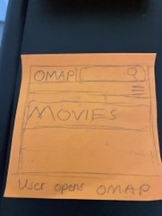
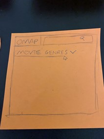
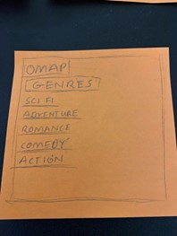
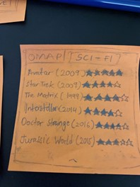
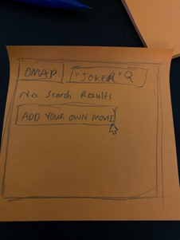
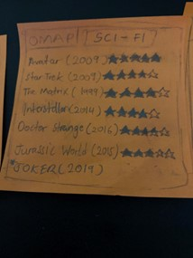
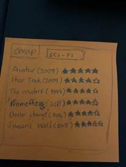
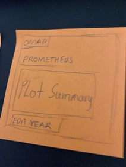
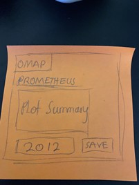
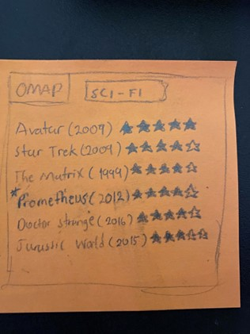

# OMAP - Online Movie Archive Project
## Introduction
Do you want a place to see the top rated movies? Collaborate on that list to add your personal favorites?
+ See top rated international movies
+ Add your own personal favorite movie to the list

## Storybaord
insert storyboard here
## Functional Requirements
#### Given
user has application opened 
#### When 
the user opens the app 
#### Then
the user views a feed of movies

---

#### Given 
the user opens the app. 
#### When 
the user clicks on a movie. 
#### Then
the user views additional information about the movie

---

#### Given
the user opens the app. 
#### When 
the User clicks on a movie. 
#### When 
the user sees genre is incorrect. 
#### Then 
the user edits the genre to the correct genre.

---

#### Given 
the user is in the app. 
#### When
the user clicks to add a movie. 
#### When 
the user enters the fields, but leaves movie name blank.
#### Then
an error is thrown showing that the movie name is not entered.

---

#### Given
the user opens the app. 
#### When 
the user sees an outdated movie, they delete it.
#### Then 
the movie is deleted.

---

#### Given 
Bill opens the app.Bill searches for his movie, no search results show up.
#### When 
Bill decides to add his movie.
#### When
Bill fills in “Joker” as the movies name. 
#### When
bill fills in “2019” as movie year.
#### When 
Bill fills in “Drama” as the movie genre. 
#### When
Bill adds the movie.
#### Then
the newly added movies shows up on the table.

---

## Scrum Roles

- **Product Owner/Scrum Master**: Anand Pandey
- **Front-End Developvers**: Bill Appiagyei, Pruthvi Patel
- **Back-End Developers**: Anand Pandey & Pranav Mahajan

---

## Storyboard

Scene 1 (User Opens OMAP and clicks on MOVIES)

Scene 2 (Displays Movie Genres with drop down menu)

Scene 3 (User clicks on drop down menu)

Scene 4 (User clicks on SCI-FI)

### Scenario 1 
Scene 5 (User searches for movie but no results come up but an option to add their own movie is available)

Scene 6 (User adds movie)

Scene 7 (Movie is added to list)

### Scenario 2 
Scene 8 (Date of release on “Prometheus” is wrong so the user can correct the date)

Scene 9 (User clicks on Prometheus )

Scene 10 (User corrects date and saves)

Scene 11 (Movie date is corrected in list)
